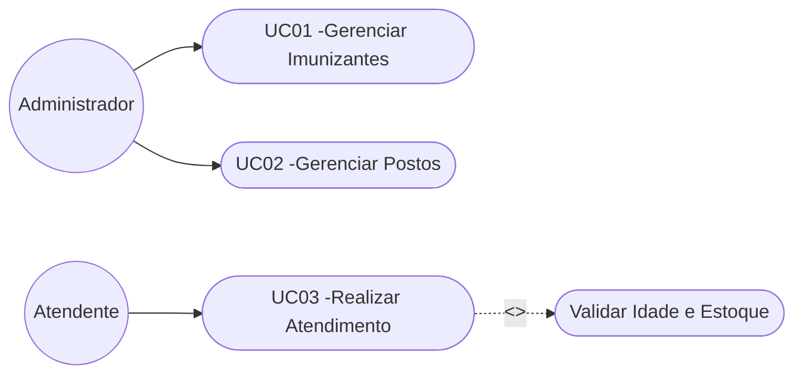
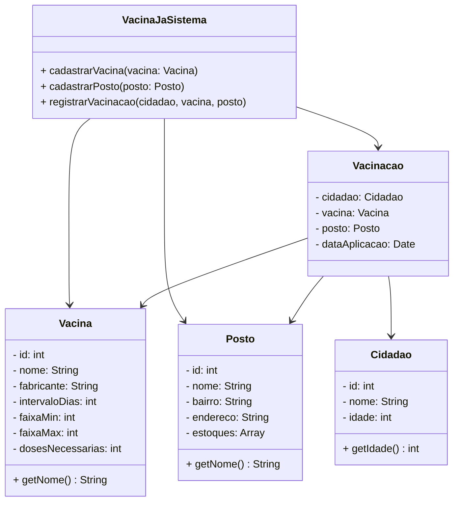

# VacinaJa

**Integrantes do Grupo:**
- Caio de Souza Campos: 1250205487
- Guilherme Augusto Venancio Umebara: 1250203282
- Fernando Menezes Negrão: 1250203095

---

### 1. Contexto do Minimundo
O VacinaJa é um programa criado para otimizar e simplificar a vacinação nos postos de saúde. Sua meta primordial é assegurar um acompanhamento minucioso da administração das vacinas, confirmando os critérios particulares de cada uma (tais como idade adequada, tempo entre aplicações e o número total de doses). O programa também supervisiona a quantidade de vacinas disponíveis em cada local de atendimento e registra quem já foi vacinado, prevenindo erros na aplicação e auxiliando na organização de recursos para a saúde pública.

### 2. Atores do Sistema
- **Administrador:** Ele é quem insere as informações essenciais do sistema, como os tipos de vacinas existentes (com suas diretrizes) e as unidades de saúde.
- **Recepcionista / Profissional de Saúde:** Usa o sistema durante o atendimento para verificar o que há em estoque, confirmar se o paciente pode receber a vacina e anotar a aplicação no registro do cidadão.

### 3. Definição de Necessidades e Cenários de Uso

**Requisitos Funcionais (RF):**
* **RF01:** É necessário que o sistema possibilite o registro de novas vacinas, incluindo suas diretrizes (limite de idade inferior/superior, período em dias, laboratório).
* **RF02:** O sistema deverá permitir a inclusão de unidades de saúde.
* **RF03:** O sistema deve oferecer a capacidade de registrar indivíduos.
* **RF04:** O sistema registrará a administração de uma vacina em um indivíduo.
* **RF05:** O sistema verificará de forma automática se o indivíduo se enquadra na idade permitida para a vacina e sinalizará um erro caso contrário.
* **RF06:** O sistema deduzirá do inventário do posto a dose administrada e indicará um erro caso não haja o item em estoque.

**Requisitos Não Funcionais (RNF):**
* **RNF01:** É obrigatório que o desenvolvimento do sistema seja efetuado utilizando a linguagem Java.
* **RNF02:** A codificação precisa obedecer ao paradigma da Orientação a Objetos.
* **RNF03:** O sistema necessita empregar o tratamento de falhas por meio de Exceções Personalizadas.
* **RNF04:** As informações precisam ser guardadas na memória enquanto o sistema estiver em operação, com o uso de Arrays/Listas.

**Casos de Uso (UC):**
* **UC01 - Administração de Vacinas:** Associado a RF01.
* **UC02 - Gestão de Locais de Vacinação:** Associado a RF02.
* **UC03 - Conduzir Processo de Vacinação:** Associado a RF03, RF04, RF05, RF06.

---

### 4. Diagrama de Casos de Uso (UML)

---

### 5. Diagrama de Classes (UML)

